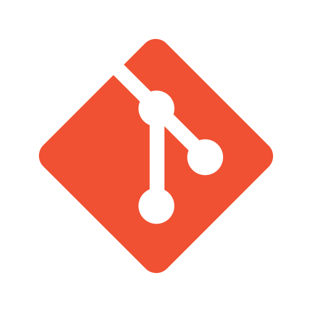
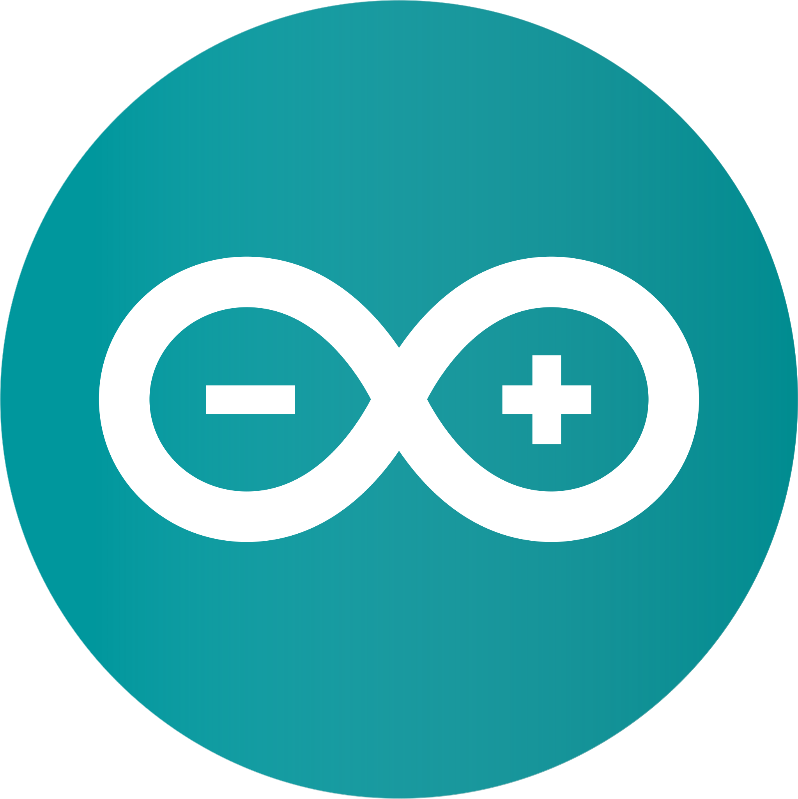

I'm Zoe. A software engineering type

Some work I've been involved with:
- [Expanded NFT](https://github.com/joinzien/expanded-nft) and [Scarce Editions](https://github.com/joinzien/scarce-editions) - NFT contracts for art.
- [ERC223 Token Standard](https://github.com/Dexaran/ERC223-token-standard) and [Asset Token](https://github.com/clearmatics/asset-token) - Token standards and contracts.
- [Blockhooks](https://github.com/EthereumWebhooks/blockhooks) - Webhooks from Ethereum events.
- [Raycasting Terrain](https://github.com/zoenolan/RaycastingFractalTerrain) and [Planet Generation](https://github.com/zoenolan/FractalPlanetGeneration) - Procedural modelling of landscapes and planets.

<h4 align="left">Connect with me:</h4>

          

<h4 align="left">Languages and Tools:</h4>

         
    

