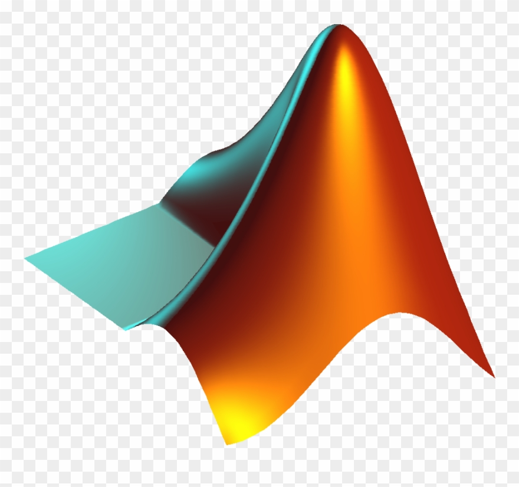

I am a software engineering leader with over 15 years of diverse experience ranging from low-level hardware to cloud services, microservices, big data and blockchain development. My prior work includes wholesale banking settlement platforms, building web-scale messaging platforms and development of real-time video encoders, GPU architecture, and game engines. 

Connect with me

Some work I've been involved with:
- Chatbots - [Rules-based](https://github.com/zoenolan/chatbot), [combined LLM and rules-based](https://github.com/zoenolan/hybrid-chatbot), [with long term memory](https://github.com/zoenolan/stateful-chatbot) and [as an agent with API access to the wider world](https://github.com/zoenolan/api-chatbot).
- LLM based tools - [Batch summary generator](https://github.com/zoenolan/batch-summary).
- NFT contracts for art - [Expanded NFT](https://github.com/joinzien/expanded-nft), [Open Editions](https://github.com/joinzien/open-editions) and [Scarce Editions](https://github.com/joinzien/scarce-editions).
- Token standards and contracts - [Asset Token](https://github.com/clearmatics/asset-token) and [ERC223 Token Standard](https://github.com/Dexaran/ERC223-token-standard).
- Webhooks from Ethereum events - [Blockhooks](https://github.com/EthereumWebhooks/blockhooks).
- Procedural modelling of landscapes and planets - [Raycasting Terrain](https://github.com/zoenolan/RaycastingFractalTerrain) and [Planet Generation](https://github.com/zoenolan/FractalPlanetGeneration).

Languages and Tools

 
 
 

 

 
 

 
 
 
 

  

 
 
 
 

 
  

   

 
 

   

